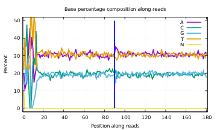
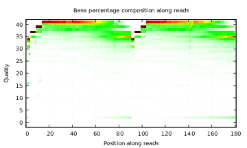

# fqcheck
<b>fqcheck: A new simple and efficient software to stat base and quality distribution of fq file</b>

###  1) Install
------------
<b>fqcheck v2.09</b>

<h3>What's new in v2.09</h3>
<ul>
<li>Bug fixes: added missing <b>pclose()</b> calls in plot module; removed dead code (<i>GetShiftQ</i>, unused variables); fixed header guard in source file</li>
<li><b>cycle_qual</b> array dimension swapped for better cache locality</li>
<li>Simplified q_err initialization (removed redundant pow computations)</li>
<li>Makefile cleanup (removed non-existent include/lib directories)</li>
</ul>

<h3>What's new in v2.08</h3>
<ul>
<li><b>rapidgzip</b> parallel decompression engine — up to <b>20× faster</b> on large gzip files</li>
<li>OpenMP parallel processing for Paired-End mode (both files processed concurrently)</li>
<li>Batch buffered reading for reduced I/O overhead</li>
<li>C++17 required (for rapidgzip)</li>
</ul>

For <b>linux/Unix </b> static
</br>you can use the statically compiled programs <i>directly</i>
<pre>
         chmod 755 ./bin/fqcheck
        ./bin/fqcheck </pre>

  </br> Just [make]  or [sh  make.sh ]  to compile this software.the final software can be found in the Dir <b>[bin/fqcheck]</b>
  </br> For <b>linux /Unix </b> and <b>macOS</b>
  <pre>
        tar -zxvf  fqcheckXXX.tar.gz
        cd fqcheckXXX;
        make ; make clean
        ./bin/fqcheck  </pre>
  
<b>Compile dependencies:</b> g++ >= 7 (C++17), <a href="https://zlib.net/">zlib</a>, and <b>rapidgzip</b> source included under src/rapidgzip/

###  2) Example of fqcheck
------------
* 1) Parameter description:
```php


Usage:fqcheck  -InFq1 <in.fq>  -OutStat1 <out.fqcheck>  [options]

		-InFq1        <str>   File name of InFq Input
		-OutStat1     <str>   Prefix of OUT File name

		-InFq2        <str>   File name of InFq2 Input
		-OutStat2     <str>   Prefix of OUT File2 name

		-Adapter1     <str>   Input adapters fa file
		-Adapter2     <str>   Input adapters2 fa file

		-help                 show this help[hewm2008 v2.09]

```

* 2) To Stat Fq file see the Dir [example]

```
# 2.1) Paire-End fq file
      ../bin/fqcheck	-InFq1	B_1.fq.gz	-InFq2	B_2.fq.gz	-OutStat1	1	-OutStat2	2.fqcheck

# 2.2) Singel-End  fq file
      ../bin/fqcheck	-r	B_1.fq.gz	-c	1 

# 2.3) Fq file withe adapters files
      ../bin/fqcheck	-InFq1	B_1.fq.gz	-OutStat1	1.fqcheck	-InFq2	B_2.fq.gz	-OutStat2	2	-Adapter1	iPE-3.fa	-Adapter2	iPE-5.fa
```


###  3) Results
------------
some stat file will ouput.  
Also if the system has <b> gnuplot</b> and <b> convert</b> commands installed, the following pictures will be output





###  4) Discussing
------------
- hewm2008@gmail.com / hewm2008@qq.com
- join the<b><i> QQ Group : 125293663</b></i>


######################swimming in the sky and flying in the sea ########################### ##
